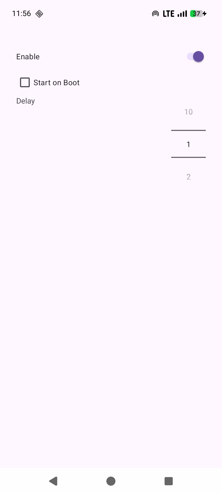

## Description

Simple app for Android that shows network speed and total traffic since app was
started in a notification. I wanted speed to be shown in statusbar at first but
it's only possible to show an icon there as far as I know.

For openness, I did use some LLMs to generate some code and help developing the
app since I am not that familiar with developing Android apps, even I have done
a few without the help of LLMs but I wasn't familiar with the APIs needed for
this app.

## Screenshots

  
  

## Install

From  or compile and install yourself.

## License

GPL3.
